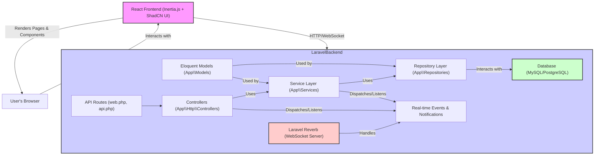

# Akana Task Management App: System Architecture

## 1. System Overview

Akana is a monolithic web application built with Laravel for the backend and React (via Inertia.js) for the frontend. It aims to provide a comprehensive task management solution with real-time collaboration features. The UI will be constructed using ShadCN UI components for a modern and professional look and feel.

## 2. Technology Stack

* **Backend:** Laravel (Latest Stable Version, e.g., Laravel 11 or newer if available)
* **Frontend:** React, Inertia.js
* **UI Components:** ShadCN UI
* **Database:** MySQL or PostgreSQL (configurable)
* **Real-time Communication:** Laravel Reverb (WebSocket server)
* **PHP Version:** Latest stable compatible with Laravel (e.g., PHP 8.2+)
* **Node.js Version:** Latest LTS
* **Web Server:** Nginx or Apache (configured for Laravel)
* **Caching:** Redis or Memcached (optional, for performance optimization)

## 3. High-Level Architecture Diagram



**Workflow:**

1. The user interacts with the React frontend in their browser.
2. Inertia.js handles navigation and data requests, making calls to the Laravel backend.
3. Laravel routes direct requests to the appropriate controllers.
4. Controllers delegate business logic to the Service Layer.
5. Services use Repositories for data access and manipulation.
6. Repositories interact with the Database using Eloquent Models.
7. For real-time updates, events are dispatched (e.g., from Services or Controllers) and broadcast via Laravel Reverb.
8. The frontend listens for WebSocket events from Reverb and updates the UI accordingly.

## 4. Database Schema (Initial ERD)

*(This is an initial high-level ERD. Detailed attributes and relationships will be defined during development.)*

```mermaid
erDiagram
    USERS ||--o{ TEAMS_MEMBERS : "is member of"
    USERS ||--o{ PROJECTS_MEMBERS : "is member of"
    USERS ||--o{ TASKS : "assigned to"
    USERS ||--o{ COMMENTS : "authored by"
    USERS ||--o{ NOTIFICATIONS : "recipient"

    ROLES ||--o{ USERS_ROLES : "has"
    USERS ||--o{ USERS_ROLES : "has"

    TEAMS ||--o{ TEAMS_MEMBERS : "has member"
    TEAMS ||--o{ PROJECTS : "owns"

    PROJECTS ||--o{ PROJECTS_MEMBERS : "has member"
    PROJECTS ||--o{ TASKS : "contains"
    PROJECTS ||--o{ KANBAN_BOARDS : "has"

    KANBAN_BOARDS ||--o{ KANBAN_COLUMNS : "has"
    KANBAN_COLUMNS ||--o{ TASKS : "contains"

    TASKS ||--o{ TASK_ASSIGNMENTS : "assigned via"
    USERS ||--o{ TASK_ASSIGNMENTS : "assigned to via"
    TASKS ||--o{ COMMENTS : "has"
    TASKS ||--o{ TASK_ATTACHMENTS : "has"
    TASKS ||--o{ TASKS : "parent_of (subtasks)"
    TASKS }o--|| TASKS : "depends_on (dependencies)"

    USERS {
        int id PK
        string name
        string email UK
        string password
        timestamp email_verified_at
        timestamp created_at
        timestamp updated_at
    }

    ROLES {
        int id PK
        string name UK
        string description
        timestamp created_at
        timestamp updated_at
    }

    USERS_ROLES {
        int user_id PK FK
        int role_id PK FK
    }

    TEAMS {
        int id PK
        string name
        string description
        int owner_id FK
        timestamp created_at
        timestamp updated_at
    }

    TEAMS_MEMBERS {
        int team_id PK FK
        int user_id PK FK
        string role_in_team
        timestamp joined_at
    }

    PROJECTS {
        int id PK
        string name
        string description
        int team_id FK
        int owner_id FK
        string status
        date start_date
        date due_date
        timestamp created_at
        timestamp updated_at
    }

    PROJECTS_MEMBERS {
        int project_id PK FK
        int user_id PK FK
        string role_in_project
        timestamp joined_at
    }

    KANBAN_BOARDS {
        int id PK
        int project_id FK
        string name
        timestamp created_at
        timestamp updated_at
    }

    KANBAN_COLUMNS {
        int id PK
        int board_id FK
        string name
        int order
        timestamp created_at
        timestamp updated_at
    }

    TASKS {
        int id PK
        int project_id FK
        int? column_id FK
        string title
        text description
        int? assignee_id FK
        int creator_id FK
        string status
        string priority
        date due_date
        int? parent_task_id FK
        timestamp created_at
        timestamp updated_at
    }

    TASK_ASSIGNMENTS {
        int task_id PK FK
        int user_id PK FK
        timestamp assigned_at
    }

    COMMENTS {
        int id PK
        int task_id FK
        int user_id FK
        text body
        timestamp created_at
        timestamp updated_at
    }

    TASK_ATTACHMENTS {
        int id PK
        int task_id FK
        int uploader_id FK
        string file_path
        string file_name
        string mime_type
        int size
        timestamp created_at
        timestamp updated_at
    }

    NOTIFICATIONS {
        string id PK
        string type
        int notifiable_id
        string notifiable_type
        text data
        timestamp read_at
        timestamp created_at
        timestamp updated_at
    }
```

## 5. API Design Principles

* **RESTful:** APIs will follow REST principles, using standard HTTP methods (GET, POST, PUT, DELETE, PATCH).
* **Stateless:** Each API request will contain all necessary information; the server will not store client session state.
* **Versioning (Optional):** If significant API changes are anticipated, versioning (e.g., `/api/v1/...`) will be implemented.
* **JSON:** Requests and responses will primarily use JSON.
* **Error Handling:** Consistent error response formats will be used (e.g., using Laravel's default JSON error responses).
* **Authentication:** API routes will be protected using Laravel Sanctum or similar token-based authentication.

## 6. Real-time Communication Strategy

* **Laravel Reverb:** Will be used as the WebSocket server.
* **Channels:**
  * **Public Channels:** For general announcements (if any).
  * **Private Channels:** For user-specific notifications (e.g., `private-user.{userId}`).
  * **Presence Channels:** For project-specific or team-specific real-time updates, allowing awareness of who is currently active/viewing a particular resource (e.g., `presence-project.{projectId}`, `presence-task.{taskId}`).
* **Events:** Laravel events will be broadcast for actions like:
  * Task creation, update, deletion, assignment.
  * Comment creation.
  * Project updates.
  * Notifications.

## 7. Key Design Patterns

The backend architecture will strictly follow SOLID principles and utilize the following design patterns for scalability and maintainability:

* **Repository Pattern:**
  * **Purpose:** Decouples data access logic from business logic. Provides an abstraction layer over data sources (Eloquent models).
  * **Implementation:** Create interfaces (e.g., `TaskRepositoryInterface`) and concrete implementations (e.g., `EloquentTaskRepository`). Services will depend on these interfaces.
* **Service Layer Pattern:**
  * **Purpose:** Encapsulates business logic. Orchestrates operations between controllers and repositories.
  * **Implementation:** Create service classes (e.g., `TaskService`, `ProjectService`) that handle complex operations, data validation (potentially using Form Requests), and event dispatching. Controllers will be thin and delegate to services.
* **Factory Pattern (Abstract Factory or Factory Method):**
  * **Purpose:** Used for creating objects without exposing the instantiation logic to the client. Useful when the exact type of object to be created might vary.
  * **Potential Uses:**
    * Creating different types of `Notification` objects based on event type.
    * Creating different `TaskView` strategy objects (if task rendering logic varies significantly).
    * Generating different report types.
* **Strategy Pattern:**
  * **Purpose:** Defines a family of algorithms, encapsulates each one, and makes them interchangeable. Lets the algorithm vary independently from clients that use it.
  * **Potential Uses:**
    * Different task sorting strategies (by due date, priority, creation date).
    * Multiple notification delivery strategies (in-app, email, SMS).
    * Different data export formats (CSV, PDF).
* **Dependency Injection (DI):**
  * **Purpose:** Laravel's service container will be heavily utilized for DI, promoting loose coupling and testability. Dependencies (like repositories in services, or services in controllers) will be injected via constructors.
* **SOLID Principles Adherence:**
  * **Single Responsibility Principle (SRP):** Each class (Model, Repository, Service, Controller) will have a single, well-defined responsibility.
  * **Open/Closed Principle (OCP):** Software entities should be open for extension but closed for modification. Achieved through interfaces, abstract classes, and patterns like Strategy.
  * **Liskov Substitution Principle (LSP):** Subtypes must be substitutable for their base types. Careful interface design and inheritance.
  * **Interface Segregation Principle (ISP):** Clients should not be forced to depend on interfaces they do not use. Create specific, smaller interfaces.
  * **Dependency Inversion Principle (DIP):** High-level modules should not depend on low-level modules. Both should depend on abstractions. Abstractions should not depend on details. Details should depend on abstractions. (e.g., Services depending on Repository Interfaces).

## 8. Directory Structure (Key Backend Directories)

*(This outlines the primary structure within `app/`)*

```
app/
├── Console/
├── Exceptions/
├── Http/
│   ├── Controllers/
│   │   ├── Api/ (If dedicated API versioning is used)
│   │   ├── Auth/
│   │   └── ... (Feature-based controllers, e.g., ProjectController, TaskController)
│   ├── Middleware/
│   └── Requests/ (Form Requests for validation)
├── Events/ (For real-time broadcasting)
├── Jobs/ (For queued tasks)
├── Listeners/ (For handling events)
├── Mail/ (Mailable classes)
├── Models/ (Eloquent models, e.g., User.php, Project.php, Task.php)
├── Notifications/ (Notification classes)
├── Policies/ (Authorization policies)
├── Providers/
├── Repositories/
│   ├── Contracts/ (Interfaces, e.g., TaskRepositoryInterface.php)
│   └── Eloquent/ (Concrete implementations, e.g., EloquentTaskRepository.php)
├── Services/
│   ├── Contracts/ (Optional, if service interfaces are needed)
│   └── (Concrete service classes, e.g., TaskService.php)
└── ...
```

This architectural document will be updated as the project evolves.
