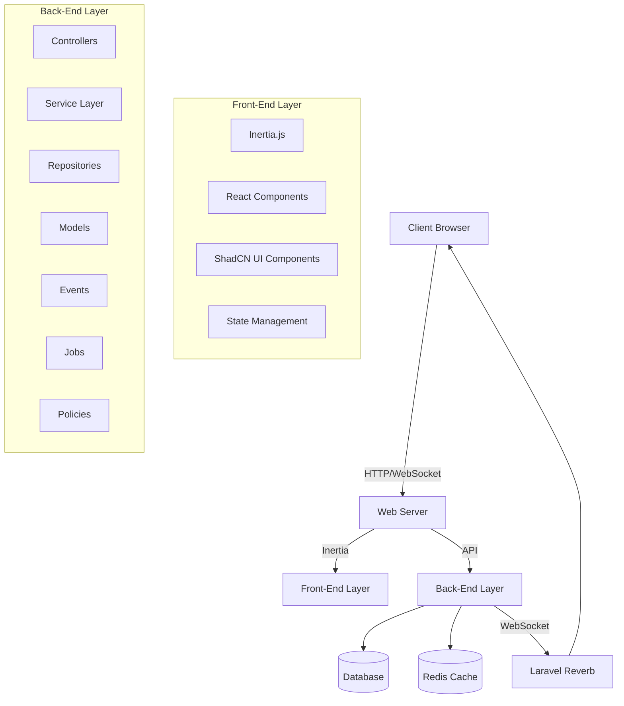
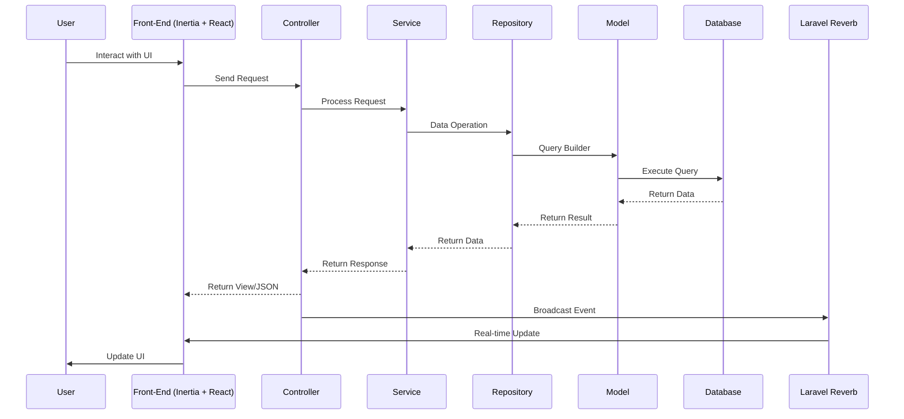

# Akana - Task Management Application Architecture

## Architecture Diagram (Conceptual)

## System Workflow (Solution Overview)

## Component Architecture

### Backend Components

1. **Controllers Layer**
   - Handles HTTP requests and responses
   - Validates input data
   - Delegates business logic to services
   - Returns appropriate responses

2. **Service Layer**
   - Contains business logic
   - Orchestrates data flow between controllers and repositories
   - Implements business rules and validations
   - Handles transactions and error handling

3. **Repository Layer**
   - Abstracts data access logic
   - Provides methods for CRUD operations
   - Implements query logic
   - Ensures data consistency

4. **Model Layer**
   - Defines database schema
   - Implements relationships
   - Defines accessors and mutators
   - Implements model-specific methods

5. **Events & Listeners**
   - Handles asynchronous operations
   - Implements real-time updates via Laravel Reverb
   - Manages WebSocket connections

### Frontend Components

1. **Inertia.js**
   - Bridges Laravel and React
   - Manages client-side routing
   - Handles data transfer between backend and frontend

2. **React Components**
   - Implements UI components
   - Manages component state
   - Handles user interactions

3. **ShadCN UI**
   - Provides styled UI components
   - Ensures consistent design
   - Implements responsive layouts

## Design Patterns

1. **Repository Pattern**
   - Abstracts data access logic
   - Provides a clean API for data operations
   - Enables easy switching of data sources

2. **Service Layer Pattern**
   - Centralizes business logic
   - Separates concerns between controllers and repositories
   - Enables reusability of business logic

3. **Factory Pattern**
   - Creates objects without specifying exact class
   - Used for creating repositories and services
   - Enables dependency injection

4. **Strategy Pattern**
   - Defines family of algorithms
   - Used for implementing different task sorting and filtering strategies
   - Enables runtime switching of algorithms

5. **Observer Pattern**
   - Implements event-driven architecture
   - Used for real-time updates via Laravel Reverb
   - Enables loose coupling between components

## SOLID Principles Implementation

1. **Single Responsibility Principle**
   - Each class has a single responsibility
   - Controllers handle requests, services handle business logic, repositories handle data access

2. **Open/Closed Principle**
   - Classes are open for extension but closed for modification
   - Use of interfaces and abstract classes

3. **Liskov Substitution Principle**
   - Subtypes must be substitutable for their base types
   - Proper use of inheritance and interfaces

4. **Interface Segregation Principle**
   - Many client-specific interfaces are better than one general-purpose interface
   - Specific interfaces for different repository types

5. **Dependency Inversion Principle**
   - Depend on abstractions, not concretions
   - Use of dependency injection
